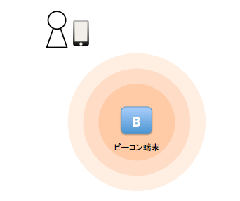

iBeacon
===
iBeacon 技術情報
---
iBeacon は、iOSアプリを開発するための領域観測サービスの一部として、リリースされました。領域観測サービスはジオフェンシングを実現するための機能で、領域に出入りを検出することができます。また、大まかな距離を測定することが可能です。（デモアプリでは大まかな距離の観測を行なっております）

iBeacon では、Bluetooth Low Energy(BLE)を利用して通信を行います。下記の図の通り、ビーコン端末がBLEの電波を発して、iOS端末が電波を受信します。

### Beacon が発信する情報
Beacon は、Beaconを識別するための次の3つの情報を送信します。
#### proximity UUID
領域観測を行うBeaconにつけるユニークな識別子のことで、特定のタイプまたは特定の組織によって発信されているものとして、1つ以上のビーコンを一意に識別します。
#### major
16ビットの符号なし整数であるメジャー値は、同じ近接UUIDを持つビーコンをグループ化するために使用する。(1-65536)
#### minor
16ビットの符号なし整数であるマイナー値は、同じ近接UUIDと同じメジャー値を持つビーコンを区別するために使用する。(1-65536)

### Beacon 領域観測
特定のproximity UUID(必要であればmajor,minorも)のビーコンエリアに入る/出るを観測することができます。入る/出るを観測して、通知を送ることができます。

### Beacon 距離観測
ビーコンからの相対距離を監視することもできます。距離観測をモニタリングするデモアプリを用意しております。実際にご確認ください。

注意) ビーコンの距離測定は、Bluetooth Low-Energy無線信号の強度検出に依存し、信号の精度は、壁や扉などの物体によって上下します。信号は水分の影響を受けるので、人体も影響を与えることになります。

デモアプリでは具体的な距離を表示する仕様となっておりますが、実際にiBeacon を使う場合には距離については３つの距離の種類で処理を切り分けてアプリを作成することをおすすめします。
#### Immediate
ものすごく近く(0m - 約1m)
#### Near
近く(約1m - 約5m)
#### Far
遠い(約5m - 約20m)

iBeacon デモアプリについて
---
本日はiBeacon を実際に用いたデモのアプリを用意いたしました。ソースは、[https://github.com/rio-development/ibeacon-mock](https://github.com/rio-development/ibeacon-mock)にありますので、ご自由にお使いください。

Rioのセミナールームに9つのビーコンを配置し、デモアプリではこの9つのビーコンをモニタリングするアプリを実際に確認することができます。

Author
---
On 2014/11/27, [NAKASHIMA Yuichi](https://github.com/nak0yui) wroted
mail: nakashima at rio.ne.jp

参考
---
[位置情報とマッププログラミングガイド https://developer.apple.com/jp/devcenter/ios/library/documentation/LocationAwarenessPG.pdf](https://developer.apple.com/jp/devcenter/ios/library/documentation/LocationAwarenessPG.pdf)

